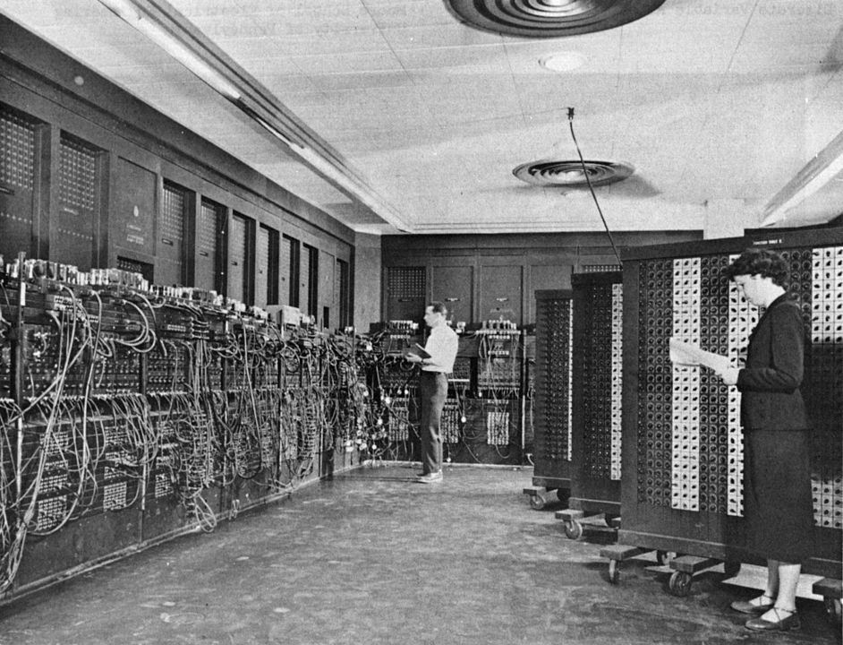

# Week 1: Introduction to Digital Scholarship

*June 1-4*

[Monday](#monday) // [Tuesday](#tuesday) // [Wednesday](#wednesday) // [Thursday](#thursday) // [Friday](#friday)

## Tuesday
June 1, 2021

### 9:00 AM - meet outside Carpenter Library

- Introductions and ice-breaker (Stella)
- Fellowship overview (Stella)
- Timesheets procedures
- Platforms & communication: Microsoft Teams (Rosemarie)
- Introduction to the College News project (Alice)
- Community expectations discussion (Alice & everyone)

### 12:00 PM Lunch (on your own)

### 1:00 PM What is Digital Scholarship? (Alice)
[Presentation slides](https://brynmawr-my.sharepoint.com/:p:/g/personal/amcgrath1_brynmawr_edu/EZMYcvVDa0pGid-DiYQf90gBxhrc9PtVGid3OjvJuheKMQ?e=xfvPWi)

### 2:00 PM Introduction to the Command Line
- Download & install [VS Code](https://code.visualstudio.com/) text editor
- [Command Line tutorial](https://github.com/tri-cods/command-line)
- If you have extra time, play [Terminus](https://web.mit.edu/mprat/Public/web/Terminus/Web/main.html)

### 4:00 PM Reflections
Write a log entry for today:
- What are you most excited about in this program or project?
- What are you most concerned about?

Please submit a response to this [questionnaire](https://forms.office.com/r/htmmUpRGvf)
---

## Wednesday
June 2, 2021

### 9:00 AM - check-in
Watch & discuss [How Computers Work videos](https://www.khanacademy.org/computing/computer-science/how-computers-work2/v/khan-academy-and-codeorg-introducing-how-computers-work)

### 10:00 AM - Project Management Workshop with Jenny Spohrer & Mari Ocando-Finol
With Digital Tech interns (via Zoom)

### 12:00 PM Lunch (on your own)

### 1:00 PM Introduction to Python
- Install Python3 from [python.org](https://www.python.org/downloads/)
- Explore Python with the DHRI [Tutorial](https://github.com/DHRI-Curriculum/python)

### 2:30 PM Break

### 2:45 PM Python - continue tutorial
- Adapting and troubleshooting
- Practice projects

### 4:30 Reflections

---

## Thursday
June 3, 2021
Carpenter

### 9:00 Check-in

### 9:30 Python - regular expressions

### 12:00 PM Lunch - Staff Get-Together
Activities and take-away lunch at Sunken Garden

### 1:00 PM College News Project Kickoff Meeting
- Discuss project proposal
- Concerns, values, and goals for project
- Brainstorming components

### 2:30 PM Exploring Digital Collections (Rosemarie)

### 4:30 Reflections

---

## Friday
June 4, 2021

*Remote all day; Alice out in PM*

### 9:00 AM Teams check-in

### 9:30 Research & Brainstorming
- On your own or in small groups

### 11:00 Discussion: project ideas

### 12:00 PM Lunch

### 1:00 PM Digital Competencies Workshop with Chris Boyland
With DT Interns, Zoom and Moodle

### 2:30 PM Python tutorials (Stella)
- Locating learning resources, useful modules, etc.

### 4:00 PM Week Wrap-up (Stella)

---

**NB**: this schedule is subject to change

[Next week >>>]
